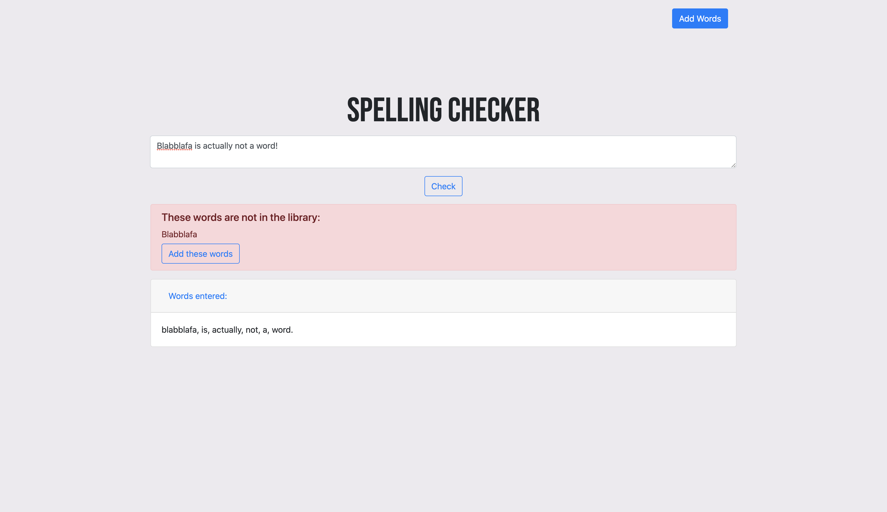

# Spelling Checker in Typescript

Remember to `npm install` packages before running. To run the application: first, `npm run tsc`, and then, `npm start`.

 

A spelling checker implemented using a Trie data structure in Typescript. Allows for creating custom dictionaries, using text or file input. 
